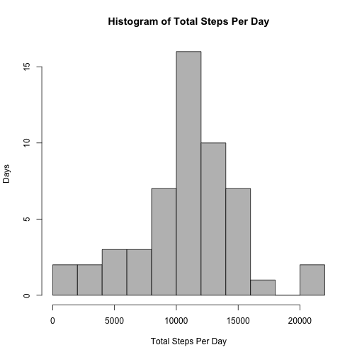
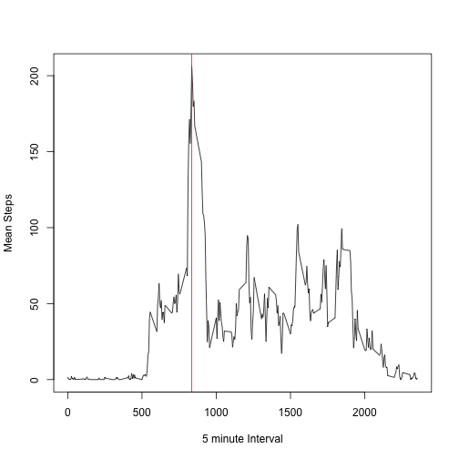
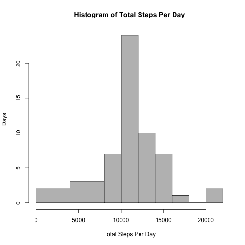
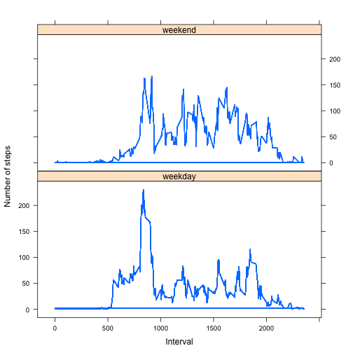

# Reproducible Research: Peer Assessment 1

### Loading and preprocessing the data

#### 1. Load the data (i.e. read.csv())

The activity.zip file is assumed to be in the working directory.


```r
unzip("activity.zip")
raw <- read.csv("activity.csv", header = T)
```


#### 2. Process/transform the data (if necessary) into a format suitable for your analysis

No pre-processing is required. Any minimal processing will be done during the steps.

### What is mean total number of steps taken per day?

#### 1. Make a histogram of the total number of steps taken each day

Using split() and sapply() I will first split the data by the individual dates, and then apply the sum() function to each day to get a vector containing the total steps per day.


```r
bydays <- split(raw$steps, raw$date)
totalstepsperday <- as.vector(sapply(bydays, sum))
hist(totalstepsperday, breaks = 10, col = "grey", main = "Histogram of Total Steps Per Day", 
    ylab = "Days", xlab = "Total Steps Per Day")
```

 


#### 2. Calculate and report the mean and median total number of steps taken per day


```r
meansteps <- mean(totalstepsperday, na.rm = T)
mediansteps <- median(totalstepsperday, na.rm = T)
```


The **mean** total steps per day is **10766.19**

The **median** total steps per day is **10765**

## What is the average daily activity pattern?

#### 1. Make a time series plot (i.e. type = "l") of the 5-minute interval (x-axis) and the average number of steps taken, averaged across all days (y-axis)


```r
byInterval <- split(raw$steps, raw$interval)
meanStepsInterval <- sapply(byInterval, mean, na.rm = T)
intervals <- as.vector(names(meanStepsInterval))

plot(intervals, meanStepsInterval, type = "l", xlab = "5 minute Interval", ylab = "Mean Steps")
abline(v = 835, col = "red")
```

 


#### 2. Which 5-minute interval, on average across all the days in the dataset, contains the maximum number of steps? ###

The interval with the maximum mean steps can be found by sorting the meanStepsInterval largest to smallest. The first item on the list will correspond to the right interval. 
  

```r
sorted <- sort(meanStepsInterval, decreasing = TRUE)
interval <- names(sorted[1])
```


The maximum number of steps can be found at interval **835**. The above plot shows the location of interval **835** on the x-axis.

### Imputing missing values

Note that there are a number of days/intervals where there are missing values (coded as NA). The presence of missing days may introduce bias into some calculations or summaries of the data.

#### 1. Calculate and report the total number of missing values in the dataset (i.e. the total number of rows with NAs)

I create a logical vector to see how many NA's are present in the steps column of the raw data frame. I then sum them to find the total (since TRUE = 1).


```r
stepsNas <- is.na(raw$steps)
NasCount <- sum(stepsNas)
```


There are **2304** NAs in the dataset.

#### 2. Devise a strategy for filling in all of the missing values in the dataset. The strategy does not need to be sophisticated. For example, you could use the mean/median for that day, or the mean for that 5-minute interval, etc.

As suggested I will replace the missing values with the mean for that particular interval.

- duplicate the raw data to a new dataframe that will be filled in.
- multiply the logical vector stepsNas by meanStepsInterval. This will give me a vector that is the mean steps for that interval if it is originally missing, and give me 0 if the value is originally pressent
- convert the NA's to 0.
- now I can add the two vectors. Original missing values, now at 0, will be added to the means for that interval, and the original present values will be added to 0, remaining the same.

If an original value was 0, however it will remain at 0. This does not mean it was missing.

#### 3. Create a new dataset that is equal to the original dataset but with the missing data filled in.


```r
rawNoNA <- raw
meansIntervalOrZero <- stepsNas * meanStepsInterval
rawNoNA$steps[is.na(rawNoNA$steps)] <- 0
rawNoNA$steps <- rawNoNA$steps + meansIntervalOrZero
```


#### 4. Make a histogram of the total number of steps taken each day and Calculate and report the mean and median total number of steps taken per day. Do these values differ from the estimates from the first part of the assignment? What is the impact of imputing missing data on the estimates of the total daily number of steps?

This would be a repeat of the first question but instead of using the raw dataframe I would use the *rawNoNa*.


```r
bydaysNoNA <- split(rawNoNA$steps, rawNoNA$date)
totalstepsperdayNoNA <- as.vector(sapply(bydaysNoNA, sum))
hist(totalstepsperdayNoNA, breaks = 10, col = "grey", main = "Histogram of Total Steps Per Day", 
    ylab = "Days", xlab = "Total Steps Per Day")
```

 

```r
NoNAmeansteps <- mean(totalstepsperdayNoNA)
NoNAmediansteps <- median(totalstepsperdayNoNA)
```


The new mean is **10766.19**

The new median is **10766.19**

The new mean will remain unchanged (since we've replaced all the missing values with the mean). The median has moved ever so slightly from 10765.

### Are there differences in activity patterns between weekdays and weekends?

For this part the weekdays() function may be of some help here. Use the dataset with the filled-in missing values for this part.

#### 1. Create a new factor variable in the dataset with two levels – “weekday” and “weekend” indicating whether a given date is a weekday or weekend day.

 - First I need to coerce the **date** column into an actual date type.

 - Then I need to add a new empty column, **weekday(date)**. 

 - Add a new column, **daytype**, factor, with 2 values, "weekend" and "weekday".


```r
rawNoNA$date <- as.Date.character(rawNoNA$date, "%Y-%m-%d")
rawNoNA$dayofweek <- weekdays(rawNoNA$date)

## create the empty column
rawNoNA$weekend <- ""

## subset weekdays and set the weekend column to read weekday
rawNoNA$daytype[rawNoNA$dayofweek == "Monday"] <- "weekday"
rawNoNA$daytype[rawNoNA$dayofweek == "Tuesday"] <- "weekday"
rawNoNA$daytype[rawNoNA$dayofweek == "Wednesday"] <- "weekday"
rawNoNA$daytype[rawNoNA$dayofweek == "Thursday"] <- "weekday"
rawNoNA$daytype[rawNoNA$dayofweek == "Friday"] <- "weekday"
rawNoNA$daytype[rawNoNA$dayofweek == "Saturday"] <- "weekend"
rawNoNA$daytype[rawNoNA$dayofweek == "Sunday"] <- "weekend"
rawNoNA <- transform(rawNoNA, daytype <- factor(daytype))
```


#### 2. Make a panel plot containing a time series plot (i.e. type = "l") of the 5-minute interval (x-axis) and the average number of steps taken, averaged across all weekday days or weekend days (y-axis). The plot should look something like the following, which was creating using simulated data:

 - Now I have to calculate the new means by both interval and weekend.

 - I will **split()** the raw (noNA) data and then apply the *mean* function with **sapply()**.

- Because the demo was created using Lattice, I have opted to use the same graphing library.


```r
newbydays <- split(rawNoNA$steps, list(rawNoNA$interval, rawNoNA$daytype))
newMeans <- sapply(newbydays, mean)
rawNoNA$newIntervalMean <- newMeans[paste(rawNoNA$interval, as.character(rawNoNA$daytype), 
    sep = ".")]

library(lattice)

xyplot(newIntervalMean ~ interval | daytype, data = rawNoNA, layout = c(1, 2), 
    type = "l", xlab = "Interval", ylab = "Number of steps")
```

 


To answer the main question, yes there are differences in activity patterns between weekdays and weekends. There appears to be generally more steps taken during weekends, than taken during weekdays. Both weekdays and weekend walking seems to peak in the morning around 8:35 AM.
